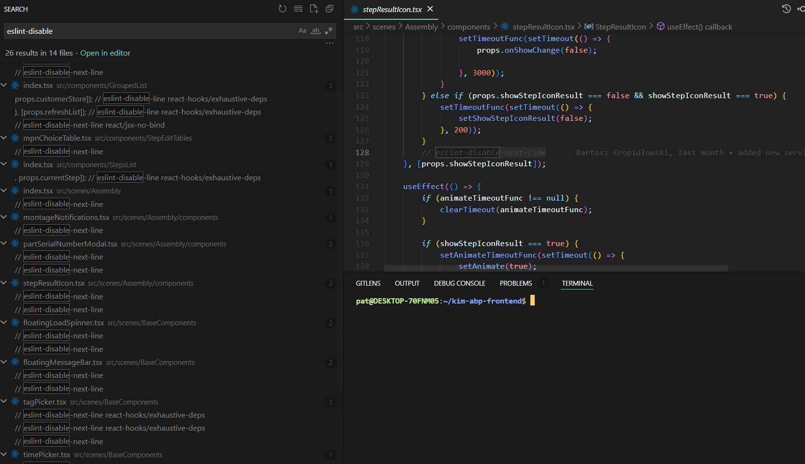
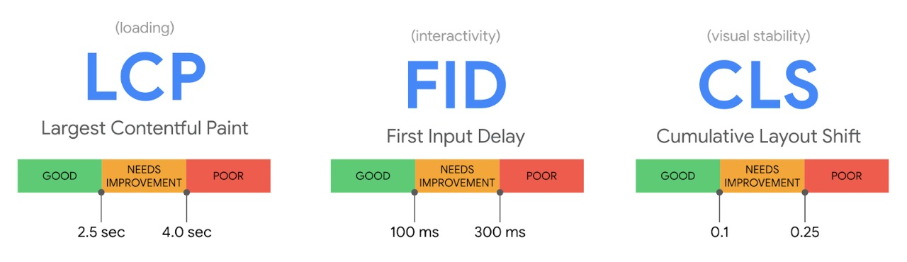
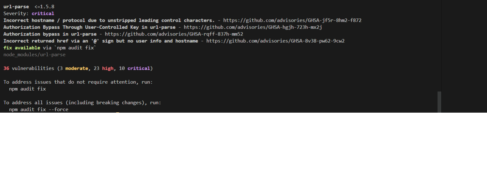
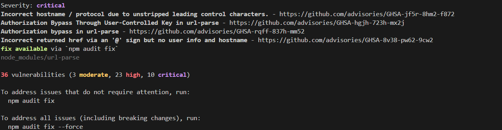

# Coding Standards Proposal

Zgodnie z tym o czym mówiliśmy podczas naszego spotkania mam następujące propozycje implementacji linterów oraz prettierów do nowych repozytoriów.

## Solution 1: Obraz docker ze skonfigurowanym VSCode'em

**Pros:**
- nie dodajemy żadnych dodatkowych pakietów do codebase'u.
- błędy są wyłapywane już na etapie pisania kodu w edytorze

## Rozwiązanie 2: Git hook odpalany przy każdej próbie commit'a do repo

**Pros:**
- standardy z opcjonalnych stają się obowiązkowe. Nie będzie można dodać commit'a jeśli linter pokaże jakieś błędy (w przypadku ESLinta). Każdy plik będzie formatowany zgodnie z ustalonymi wcześniej standardami przed każdym commit'em.

### ESLint
Jedynym rozwiązaniem na ominięcie tego ograniczenia jest dodanie odpowiedniej klauzuli w kodzie `eslint-disable-next-line`. Dzięki temu w bardzo łatwy sposób można wyłączyć regułę, ale trzeba wyraźnie zaznaczyć to w kodzie. W przypadku noża na gardle można będzie  pushować kod i łatwo będzie znaleźć miejsca wymagające refaktoryzacji.

EsLint jest domyślnie dodawany jako peer-dependency do `create-react-app`. W swoich projektach macie już to zatem dodane te ustawienia. Nic nie trzeba robić.

### Automatyczne formatowanie kodu za pomocą prettier'a.

Tego rozwiązania nie macie jeszcze zaimplementowanego. Ja stosuję dokładnie takie jak zaprezentowane w dokumentacji - [Link do rozwiązania](https://create-react-app.dev/docs/setting-up-your-editor/#formatting-code-automatically). Implementacja jest prosta i powinna zająć 15-20 minut. Dzięki temu wymuszamy takie samo formatowanie plików przez wszystkich, którzy pushują do tego samego repozytorium. Ułatwia to późniejsze czytanie kodu, pozwala uniknąć bezsensownych debat (dodajemy semicolony czy nie, 2 spacje czy 1 tab jako wcięcie itd.) oraz zapobiega powstawaniu irytujących merge-conflict'ów.

Jeśli Bartek stosuje już formatowanie za pomocą prettier'a (Podejrzewam, że stosuje) to ja chętnie dostosuję się do jego konfiguracji. Jeśli nie - skorzystam z domyślnej stworzonej przez autorów biblioteki. 

### SonarLint & SonarCube

SonarCube wymaga własnego serwera. Możemy go łatwo dodać na Azure za pomocą obrazu docker'a. Oficjalna wersja znajduje się tutaj [SonarQube Docker Image](https://hub.docker.com/_/sonarqube). Którą wersję chciałbyś zaimplementować?

W kwestii implementacji Sonar'a jako `pre-commit hook` to tutaj jeszcze nie wiem jak to zrobić.

Obecnie czytam te dwa artykuły:

[SonarQube as pre-commit hook](https://achintyac77.medium.com/sonarqube-with-pre-commit-hook-a40d6689634a)

[OUTDATED: Pre-commit SonarQube Implementation](https://blog.sonarsource.com/three-options-for-pre-commit-analysis/)

Myślę, że temat jest do ogarnięcia, jeśli wyrazisz zgodę to mogę nad tym popracować.

**Wymagania:**
Poniższe wymagania dodają kilka dodatkowych pakietów do Waszego repo. Nie wiem jaka jest Wasza polityka w kwestii dodawania nowych pakietów do codebase'u. Każdy nowy pakiet to potencjalny wektor ataku i luka w zabezpieczeniach, więc zawsze wolę zapytać zanim coś dodam. 

- [Husky](https://github.com/typicode/husky)
- [Lint-staged](https://github.com/okonet/lint-staged)
- [Prettier](https://github.com/prettier/prettier)

## Tematy opcjonalne jeszcze nie omówione:
Poniżej przedstawiam także 3 dodatkowe propozycje. Są to rozwiązania, z których sam korzystam, więc mam doświadczenie w ich implementacji. Jeśli uznasz coś za warte dodania to chętnie się tym zajmę.

### Commit Lint
Wymuszenie pewnych standardów, co do dodawanych commitów. 
Ja korzystam z tego rozwiązania - [Conventional Commit](https://www.conventionalcommits.org/en/v1.0.0/).

Od juniorków oczekiwałbym, aby dodawali nagłówki do swoich commit'ów ze względu na ich funkcjonalność. Do nagłówka można dodać także scope (opcjonalnie). Poniżej zamieszczam kilka przykładów commitów jakich oczekiwałbym od juniorów. Założyłem podział scope'u na `front` - zmiany we frontendzie oraz `back` - zmiany w backend:

**Przykładowe commity juniora:**

`feat` - implementacja nowej funkcjonalności

Ex.1 - `feat(front): create Footer component`

Ex.2 - `feat(front): add onSubmit event handler`

`fix` - naprawa błędów

Ex.1 - `fix(front): button text typo`

Ex.2 - `fix(front): add missing case statement`

`docs` - komentarze, dokumentacja, przykłady użycia

Ex.1 - `docs(front): add jsdoc header with examples`

Ex.2 - `docs(front): add comment about edge-case`

`styles` - zmiany wyłącznie w części wizualnej aplikacji

Ex.1 - `styles(front): add padding to form element`

Ex.2 - `styles(front): add hover styles`

`refactor` - wszelkie zmiany dotyczące refaktoryzacji

Ex.1 - `refactor(front): extract list rendering to separate function`

Ex.2 - `refactor(front): add default parameters to function declaration`

### Core Web Vitals
Nowe standardy Google w obszarze User Experience. Moim zdaniem te standardy to game-changer w kwestii frontendu. Od tego roku Google każe strony, które nie zapewniają swoim użytkownikom odpowiedniego standardu. Wyniki z Lighthouse'a będą mają bezpośredni wpływ na ranking strony w wynikach wyszukiwania:

Więcej informacji możesz znaleźć tutaj:

[Core Web Vitals - Official](https://web.dev/vitals/)

[Core Web Vitals - What You NEED To Know](https://www.30degreesnorth.com/blog/industry-update-google-is-focusing-on-better-page-experience)

Kluczowe metryki mierzące poziom zadowolenia użytkownika:

Nie ma co być przesadnym purystą. Osiągnięcie 100% często jest bardzo ciężkie. Jednak myślę, że standard wynoszący min. 90% z każdego zestawu testów przy nowych projektach jest jak najbardziej osiągalny bez utraty produktywności.

### Snyk
Monitoring open-source'owych pakietów w poszukiwaniu zagrożeń dotyczących bezpieczeństwa aplikacji. 

Rzuciłem okiem na repozytoria, które kazałeś mi przejrzeć

Kimball:

Farmwet:

Snyk ułatwia identyfikację i ocenę ryzyka związaną z zagrożeniami tego typu. Nie mówię, że musimy od razu wszystko naprawiać, ale warto przynajmniej monitorować sytuację i mieć świadomość, jakie pakiety w pierwszej kolejności wymagałby upgrade'u. Ja z mojej strony chciałbym monitorować sytuacje i nie przyczyniać się do dodawania nowych zagrożeń w naszych repozytoriach.